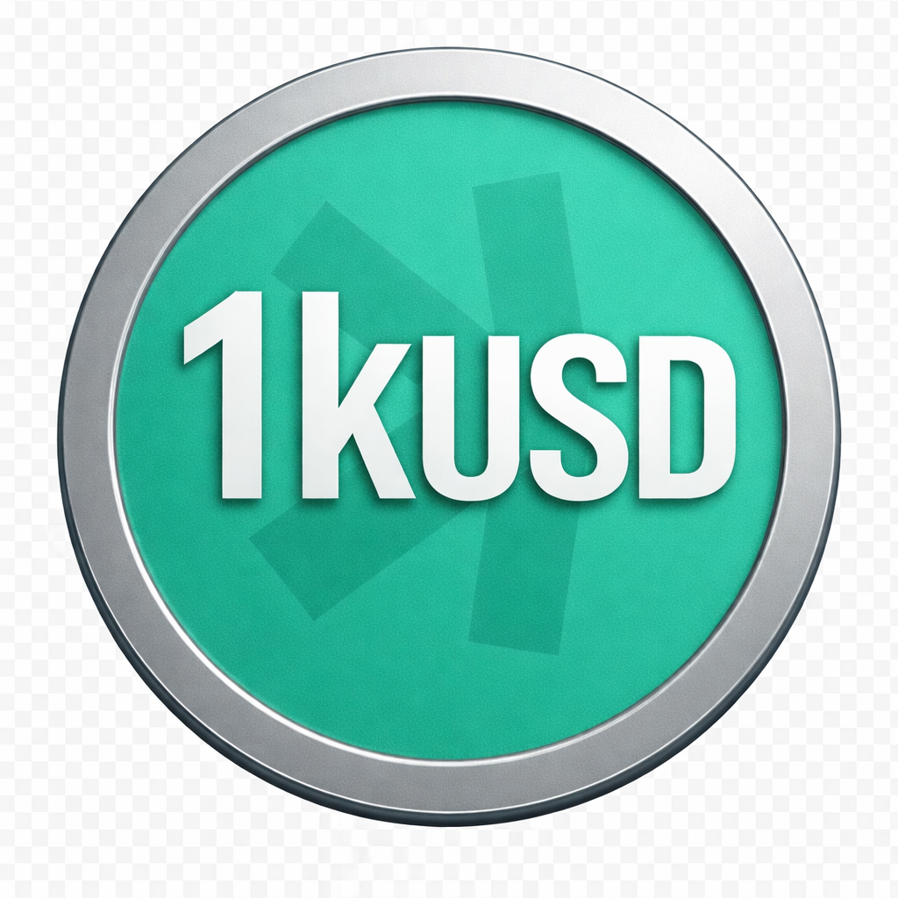

  

# 1kUSD Stablecoin Protocol

**A collateralized stablecoin research and testnet implementation.**

!!! warning "Not production-ready"
    1kUSD has no documented mainnet deployment and has not completed an
    independent external audit. The current EVM implementation contains a mock
    oracle, governance/fee stubs, placeholder tests, and open role findings. Do
    not use it with real funds.

## Intended mechanism

The product goal is a fully collateralized USD-targeting asset with:

- one-to-one reserve and liability accounting;
- permissionless PSM mint/redeem against approved collateral;
- no CDP debt or liquidation engine;
- bounded issuance and fail-closed oracle/configuration checks;
- limited emergency pause authority;
- timelocked multisig governance;
- transparent fees, reserves, and monitoring.

## Verified implementation status

| Area | Status |
|---|---|
| Solidity / Foundry | Builds; 198 tests passed on 2026-08-05 |
| Test assurance | 10 placeholders; 57.63% branch coverage |
| Oracle | Admin-set mock only |
| Timelock | Stub; execution not implemented |
| Fee routing | Incomplete |
| Deployment | Testnet/demo configuration |
| External audit | Not completed |

## Kaspa direction

Kaspa Toccata is the approved primary product track. Its programmability stack is
still a testnet/pre-mainnet dependency under active development and uses a
UTXO/covenant model rather than EVM accounts. The Solidity code is an executable
economic reference; the Kaspa implementation requires a separately approved
covenant, based-app, or hybrid architecture and an isolated testnet proof of
concept.

[Project status](what-is-1kusd.md) · [Mechanism](how-it-works.md) ·
[Security](security.md) · [Roadmap](roadmap.md) ·
[GitHub](https://github.com/NeaBouli/1kUSD)
