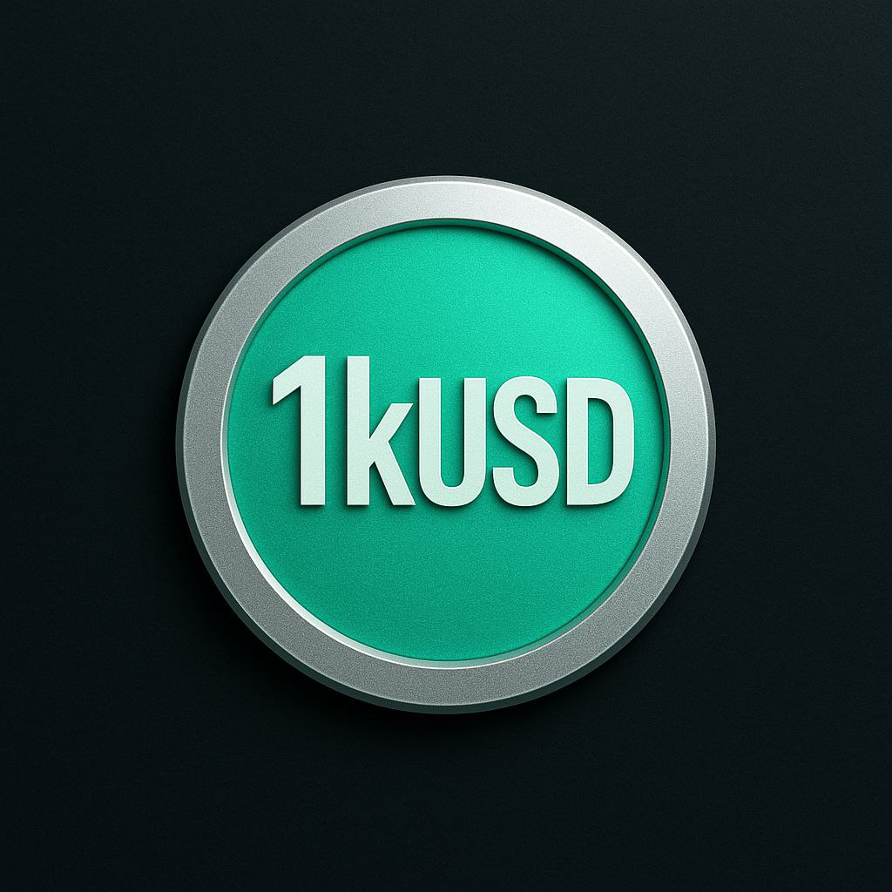

  <section class="kusd-hero" aria-labelledby="kusd-hero-title">
    

    

      
 Kaspa-primary · research &amp; testnet

      
Open stablecoin protocol

      <h1 id="kusd-hero-title">Stable value, <strong>built for Kaspa.</strong></h1>
      

        1kUSD is an open-source program for a fully collateralized,
        USD-targeting stablecoin with direct mint and redemption through a Peg
        Stability Module.
      

      

        <a class="kusd-button kusd-button-primary" href="how-it-works/">Explore the mechanism</a>
        <a class="kusd-button kusd-button-quiet" href="https://github.com/NeaBouli/1kUSD">View the source</a>
      

    

    

      

      
      
Target unit

      <strong>1 1kUSD ≈ 1 USD</strong>
    

    

      
<strong>229</strong>Foundry tests passing

      
<strong>0</strong>production deployments

      
<strong>Kaspa</strong>approved primary track

      
<strong>EVM</strong>executable reference

    

  </section>

  <aside class="kusd-truth-banner" aria-label="Important project status">
    <strong>Research system — not a live stablecoin.</strong>
    No mainnet deployment, live reserves, completed external audit, or guaranteed peg exists today. Do not use the prototype with real funds.
    <a href="security/">Read the verified limits →</a>
  </aside>

  <section class="kusd-section kusd-intro" aria-labelledby="mechanism-title">
    <header class="kusd-section-head">
      
The intended mechanism

      <h2 id="mechanism-title">Simple conversion. Strict accounting.</h2>
      
1kUSD avoids user debt positions and liquidation auctions. The target design creates and destroys supply only through collateral-backed conversion.

    </header>
    

      <article role="listitem">
        01
        <h3>Deposit</h3>
        
A user supplies approved collateral to the protocol reserve.

      </article>
      <article role="listitem">
        02
        <h3>Validate</h3>
        
Asset, oracle, limits, fees, deadline, pause state, and received value are checked.

      </article>
      <article role="listitem">
        03
        <h3>Issue</h3>
        
The PSM creates net 1kUSD against reconciled collateral value.

      </article>
      <article role="listitem">
        04
        <h3>Redeem</h3>
        
Returned 1kUSD is burned and the corresponding net collateral is released.

      </article>
    

    
<a href="how-it-works/">See the complete mint and redemption flow →</a>

  </section>

  <section class="kusd-band" aria-labelledby="architecture-title">
    

      <header class="kusd-section-head">
        
Kaspa-native architecture

        <h2 id="architecture-title">Designed for UTXOs. Not copied from Ethereum.</h2>
        
The accepted product direction targets Kaspa Toccata. ADR-042 selects a singleton control/reserve L1 covenant family for the value-capped Testnet-10 proof; production sharding remains deferred.

      </header>
      

        <article>
          L1
          
Target settlement

          <h3>Kaspa Toccata</h3>
          <ul>
            <li>Covenant-native state transitions</li>
            <li>Native asset issuance and redemption</li>
            <li>Successor-output validation</li>
            <li>Reorg-aware state discovery</li>
          </ul>
        </article>
        <article>
          P
          
Protocol controls

          <h3>PSM &amp; reserve</h3>
          <ul>
            <li>Collateral and liability reconciliation</li>
            <li>Oracle freshness and deviation policy</li>
            <li>Bounded issuance and redemption</li>
            <li>Guardian and delayed governance</li>
          </ul>
        </article>
        <article>
          O
          
Operational assurance

          <h3>Evidence &amp; monitoring</h3>
          <ul>
            <li>Reserve and supply observability</li>
            <li>Reproducible deployments</li>
            <li>Incident response and recovery</li>
            <li>Independent security review</li>
          </ul>
        </article>
      

      

        EVM reference
        
The existing Solidity system remains a testable economic specification. It is not the primary production target and will not be ported line by line.

        <a href="what-is-1kusd/">Understand the product boundary →</a>
      

    

  </section>

  <section class="kusd-section" aria-labelledby="principles-title">
    <header class="kusd-section-head kusd-head-wide">
      

        
Protocol principles

        <h2 id="principles-title">The peg is a system, not a promise.</h2>
      

      
Stable value depends on redeemable reserves, correct pricing, reliable conversion, bounded authority, liquid markets, and observable operation. Every layer must remain independently verifiable.

    </header>
    

      <article>01<h3>Fully collateralized</h3>
Every redeemable unit must be backed by approved collateral under an explicit reserve and haircut policy.
</article>
      <article>02<h3>Two-way conversion</h3>
Credible mint and redemption provide the primary economic pressure toward the USD target.
</article>
      <article>03<h3>Bounded operation</h3>
Limits, deadlines, fail-closed configuration, and narrow emergency authority contain failures.
</article>
      <article>04<h3>Transparent control</h3>
Timelocked multisig governance, visible reserves, monitoring, and incident evidence replace hidden trust.
</article>
    

  </section>

  <section class="kusd-band kusd-status-section" aria-labelledby="status-title">
    

      <header class="kusd-section-head kusd-head-wide">
        

          
Verified project truth

          <h2 id="status-title">What works. What does not.</h2>
        

        
Status is evidence-based and deliberately conservative. Passing tests describe the reference implementation; they do not prove production readiness.

      </header>
      

        <article class="kusd-status-card kusd-status-positive">
          
Verified now

          <ul>
            <li><strong>Build:</strong> Solidity reference compiles</li>
            <li><strong>Tests:</strong> 229 passing, 0 failing</li>
            <li><strong>Mechanism:</strong> PSM, vault, limits, module pause lifecycle</li>
            <li><strong>Direction:</strong> Kaspa-primary scope accepted</li>
            <li><strong>Program:</strong> tracked master plan and issue queue</li>
          </ul>
        </article>
        <article class="kusd-status-card kusd-status-blocked">
          
Still blocking release

          <ul>
            <li><strong>Oracle:</strong> admin-set mock only</li>
            <li><strong>Governance:</strong> timelock execution is a stub</li>
            <li><strong>Safety:</strong> lifecycle fixes merged; deployment role handoff still gated</li>
            <li><strong>Assurance:</strong> 8 placeholder tests; audit incomplete</li>
            <li><strong>Operations:</strong> no live reserves or production deployment</li>
          </ul>
        </article>
      

      
<a href="security/">Review security evidence and open blockers →</a>

    

  </section>

  <section class="kusd-section" aria-labelledby="roadmap-title">
    <header class="kusd-section-head kusd-head-wide">
      

        
Readiness-gated roadmap

        <h2 id="roadmap-title">Evidence before launch.</h2>
      

      
There is no mainnet date. Each phase begins only after its decision, security, and verification gates are explicitly approved.

    </header>
    

      <article class="is-complete">01

Product boundary
<strong>Kaspa primary · EVM reference</strong>
<small>Accepted</small></article>
      <article class="is-complete">02

Execution architecture
<strong>Singleton control/reserve covenant family</strong>
<small>Accepted</small></article>
      <article>03

Isolated Testnet-10 proof
<strong>Value-capped vault and issuance</strong>
<small>Approval required</small></article>
      <article class="is-next">04

Protocol hardening
<strong>Oracle, governance, accounting, safety</strong>
<small>In progress</small></article>
      <article>05

Independent assurance
<strong>Deployment evidence, audit, bounty</strong>
<small>Blocked</small></article>
      <article>06

Production readiness
<strong>Legal, reserve, redemption, operations</strong>
<small>Blocked</small></article>
    

    
<a href="roadmap/">Open the complete roadmap →</a>

  </section>

  <section class="kusd-cta" aria-labelledby="resources-title">
    

      
Open research

      <h2 id="resources-title">Inspect the design. Challenge the assumptions.</h2>
      
The code, known limitations, security reporting channel, architecture decisions, and delivery plan are public.

    

    

      <a href="whitepaper/WHITEPAPER_1kUSD_EN/">01<strong>Read the whitepaper</strong><small>Concept &amp; implementation specification</small></a>
      <a href="https://github.com/NeaBouli/1kUSD">02<strong>Review the repository</strong><small>Source, tests, issues &amp; decisions</small></a>
      <a href="community/">03<strong>Join the work</strong><small>Contributing and project channels</small></a>
    

  </section>

